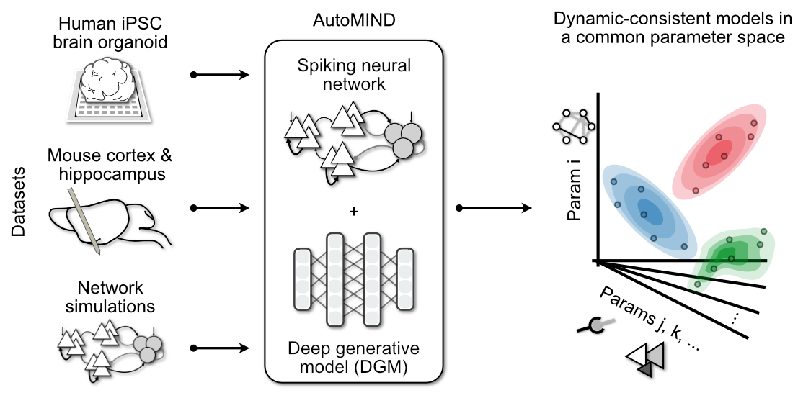

# AutoMIND

Automated Model Inference from Neural Dynamics **(AutoMIND)** is an inverse modeling framework for investigating neural circuit mechanisms underlying population dynamics.

It combines a flexible, highly parameterized spiking neural network as the mechanistic model (simulated in `brian2`) and powerful deep generative models (Normalizing Flows in `pytorch`) in the framework of simulation-based inference (powered by `sbi`) to discovery **many** parameter configurations that are consistent with target observations of neural population dynamics.

For a sneak peak of the workflow and what's possible, check out the [**overview demo**](./notebooks/demo-1_automind_workflow.ipynb) and our **preprint**, [Deep inverse modeling reveals dynamic-dependent invariances in neural circuit mechanisms](https://www.biorxiv.org/content/10.1101/2024.08.21.608969v1).

**Coming soon**: This repository contains the package `automind`, demo notebooks, links to generated simulation datasets and trained deep generative models, as well as code to reproduce figures and results from the manuscript.

