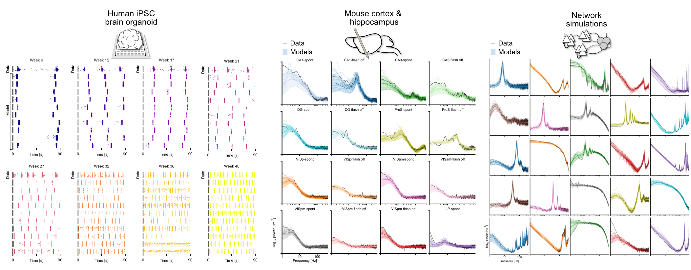

# AutoMIND

Automated Model Inference from Neural Dynamics **(AutoMIND)** is an inverse modeling framework for investigating neural circuit mechanisms underlying population dynamics.

AutoMIND helps with efficient discovery of **many** parameter configurations that are consistent with target observations of neural population dynamics. To do so, it combines a flexible, highly parameterized spiking neural network as the mechanistic model (simulated in `brian2`), with powerful deep generative models (Normalizing Flows in `pytorch`) in the framework of simulation-based inference (powered by `sbi`).

For a sneak peak of the workflow and what's possible, check out the [**overview demo**](./notebooks/demo-1_automind_workflow.ipynb) and our **preprint**, [Deep inverse modeling reveals dynamic-dependent invariances in neural circuit mechanisms](https://www.biorxiv.org/content/10.1101/2024.08.21.608969v1).

This repository contains the package `automind` (coming soon), demo notebooks, links to generated simulation datasets and trained deep generative models ([figshare link](https://figshare.com/s/3f1467f8fb0f328aed16)), as well as code to reproduce figures and results from the manuscript.

# Dataset
### Model parameter configurations, simulations, and trained deep generative models
Model configurations and simulations used to train DGMs, target observations (including experimental data from organoid and mouse), hundreds of discovered model configurations and corresponding simulations consistent with those targets, and trained posterior density estimators can be found [on figshare](https://figshare.com/s/3f1467f8fb0f328aed16). 

See [here](./datasets/README.md) for details and download instructions.

