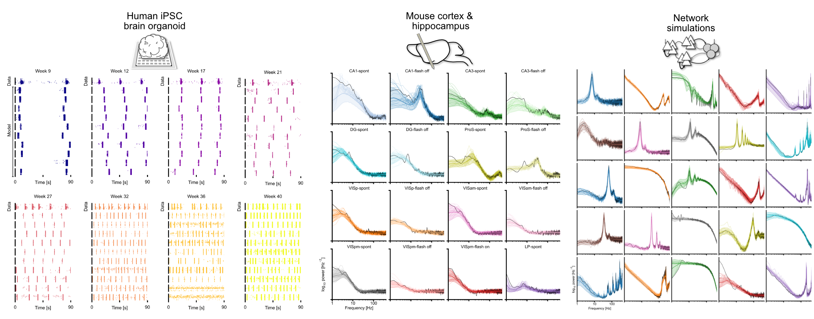

# Data Download 
### Summary data and trained DGMs

All files can be downloaded as a single file [from figshare](https://figshare.com/s/3f1467f8fb0f328aed16). Place the `.zip` file in this directory (`./datasets/`) and unzip in place preserves the correct relative paths for code demos, model training and inference, etc.

Alternatively, files can be individually downloaded and manually organized in the directory structure as follows:

---
`./training_prior_samples/`
- `training.zip`: 1-million parameter configurations and summary features from model simulations used to train deep generative models.
- `heldout.zip`: additional network simulations not used for DGM training, a subset of which was used as synthetic observations.

---
`./discovered_posterior_samples/`
- `organoids.zip`: discovered model configurations consistent with human brain organoid network burst across development. See ./organoid_predictives.png.
- `mouse-vis.zip`: discovered model configurations consistent with population firing rate PSD of Neuropixels recordings from mouse visual areas. See ./allen_predicitves_all.png.
- `mouse-hc.zip`: discovered model configurations consistent with population firing rate PSD of Neuropixels recordings from mouse hippocampal areas. See ./allen_predicitves_all.png.
- `synthetic.zip`: discovered model configurations consistent with population firing rate PSD of synthetic observations, i.e., held-out network simulations. See ./synthetic.png.
- NOTE: all `.zip` files also contain the prior distribution, posterior density estimator, and config files necessary for running the simulations and analyses.

---
`./dgms/`
- `burst_posterior.pickle`: trained conditional density estimator that approximates the posterior distribution conditioned on network burst summary features.
- `psd_posterior.pickle`: trained conditional density estimator that approximates the posterior distribution. conditioned on network firing rate power spectral densities.

---
`./observations/`
- `allenvc_summary.csv`: population firing rate PSD of Neuropixels recordings.
- `synthetic_summary.csv`: various summary features of synthetic observations (i.e., held-out network simulations).
- `organoid_summary.csv`: population firing burst statistics of organoid multi-electrode array recordings. 
- `example_raw_data.npz`: raw spike train data from an example organoid recording. 

---

Example discovered model configurations and simulations, overlaid with target observation data (first row of each subplot in organoid panels, black lines in mouse and synthetic PSD panels):

---
### Raw simulation data
Coming soon.